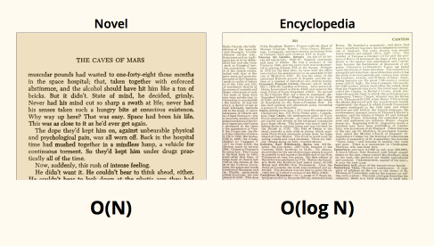
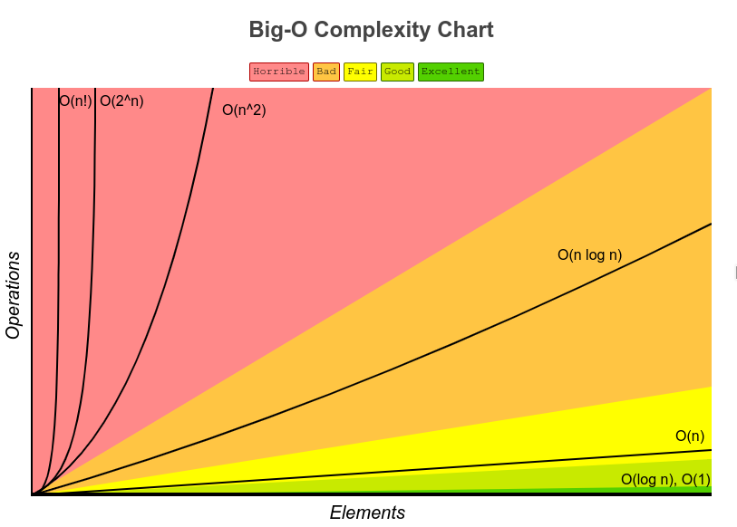
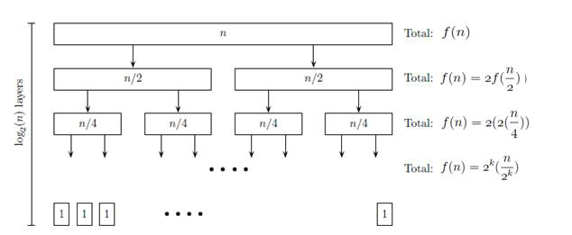

## Big O: Code Complexity as data grows

 <!-- .slide: style="color:#a23" --> 
**_Write Better Code Using Python_**  


#### Yunindyo Prabowo   

##### https://git.io/bigopyid

notes:
- umum digunakan dalam dunia computer science
- pendekatan matematis dalam dunia computer science
- membahas bagaimana algoritma yang disusun dengan/tanpa bigo berjalan

---

### Yunindyo Prabowo
---

- **profesi**: Mahasiswa 
- **email**: yunindyo.prabowo@gmail.com
- **blog**: ypraw.gitlab.io
- **github/gitlab**: @ypraw


---

## Introduction design and algorithm analysis

--

### Apa itu Algoritma?

> Algoritma merupakan langkah-langkah (Prosedur) yang harus dilakukan untuk menyelesaikan suatu masalah <!--.element: class="fragment" data-fragment-index="1" -->
notes:
- dalam mendefinisikan sebuah algoritma yg baik ada beberapa hal yang di pertimbangkan.

--

#### Masalah
> yaitu sebuah persoalan yang ingin diselesaikan oleh sebuah algoritma.
<!--.element: class="fragment" data-fragment-index="1" -->

--

#### Masukan (input)
> yaitu contoh data atau keadaan yang menjadi permasalahan.
<!--.element: class="fragment" data-fragment-index="1" -->

--

#### keluaran (output)
> yaitu bentuk akhir dari data atau keadaan setelah algoritma diimplementasikan ke masukan. Keluaran merupakan hasil ideal yang diinginkan dan dianggap telah menyelesaikan masalah.
<!--.element: class="fragment" data-fragment-index="1" -->

---

## Algoritma yang Baik

notes:
- tentu dalam menyusun algoritma yang baik di pengaruhi oleh beberapa criteria

--

### Benar
>  di mana algoritma menyelesaikan masalah dengan tepat, sesuai dengan definisi masukan / keluaran algoritma yang diberikan. <!--.element: class="fragment" data-fragment-index="1" -->

--

### Efisien
> berarti algoritma menyelesaikan masalah tanpa memberatkan bagian lain dari apliikasi. Sebuah algoritma yang tidak efisien akan menggunakan sumber daya (memori, CPU) yang besar dan memberatkan aplikasi yang mengimplementasikan algoritma tersebut <!--.element: class="fragment" data-fragment-index="1" -->

--

### Mudah di Implementasikan
> artinya sebuah algoritma yang baik harus dapat dimengerti dengan mudah sehingga implementasi algoritma dapat dilakukan siapapun dengan pendidikan yang tepat, dalam waktu yang masuk akal.
<!--.element: class="fragment" data-fragment-index="1" -->

---

### Realita ???


<!--.element: class="fragment" data-fragment-index="1" -->


---

### Big O : Asymptotic Notation for Complexity Analysis of Algorithms

---

### Definition &amp; Terminology
- O <!-- .element: class="fragment" data-fragment-index="1" --> ``` => stand for Order Of``` <!-- .element: class="fragment" data-fragment-index="2" --> 
- bla bla bla N <!-- .element: class="fragment" data-fragment-index="3" --> ```=> Banyaknya data``` <!--.element: class="fragment" data-fragment-index="4" -->

- <!--.element: class="fragment" data-fragment-index="5" --> O(N), O(log n) etc.

- not running time measure <!--.element: class="fragment" data-fragment-index="6" -->

- given 10 times data, how much time to finish??? <!--.element: class="fragment" data-fragment-index="7" -->

notes: 
- bukan mengukur seberapa cepat kode di kompilasi
- bukan mengukur seberapa banyak aksi dalam sekali running
- tapi mengukur seberapa lambatnya kode yang kita buat ketika data itu berkembang menjadi lebih banyak dari yang sebelum-sebelumnya 
- complexity
- time complexity
- algorithm complexity
- asysmtotic complexity
- it's same dude :)

--

### Examples

--

### Contoh 1

* Anda akan memberikan data penting kepada teman anda, namun anda dan teman anda berbeda kota, dengan ketentuan sebagai berikut, apa yang akan anda lakukan ????

    * anda di kota A dan teman anda di kota B dengan jarak tempuh 2 jam perjalanan.
    <!-- .element: class="fragment" data-fragment-index="1" -->

    * data yang anda berikan berukuran 1TB
    <!-- .element: class="fragment" data-fragment-index="2" -->

    * anda terhubung dengan koneksi internet dengan kecepatan rata-rata 16 Mbps
    <!-- .element: class="fragment" data-fragment-index="3" -->


--

### Solusi ????

notes:
- maka akan ada 2 solusi, jika internet lemot antar hardisknya,
- jika internet ngebut maka kirim lewat internet.

--

### Solusi pertama
<!-- .element: class="fragment" data-fragment-index="1" -->
* Anda akan mentrasfer data menggunakan akses internet tersebut
<!-- .element: class="fragment" data-fragment-index="2" -->
    - Proses ini digambarkan dalam notasi bigO sebagai O(n) dimana n menunjukan ukuran datanya, semakin banyak data yang ditransfer maka semakin bertambah linier waktu yang di perlukan
<!-- .element: class="fragment" data-fragment-index="3" -->  

notes:
- bayangkan jika datanya sebanyak 10TB atau bahkan 1 PB

--

### Solusi kedua 
<!-- .element: class="fragment" data-fragment-index="1" -->
* Anda akan memberikan hardisk fisik anda kepada teman anda
<!-- .element: class="fragment" data-fragment-index="2" -->
    - - Proses ini digambarkan dalam notasi bigO sebagai O(1) dimana 1 menunjukan konstanta, nilai konstan 1 menunjukan bahwa operasi ini tidak akan berpengaruh terhadap ukuran data, jika waktu tempuh 2 jam makan 10TB atau 1 rak server berukuran 1 PB pun akan sampai 2 jam.
<!-- .element: class="fragment" data-fragment-index="3" -->

---

### Another Analogy

--

### Finding Word

<!-- .element height="60%" width="65%" -->
<!-- .element: class="fragment" data-fragment-index="1" -->

notes:
- buka buku pada tengah bagian
- tentukan kata yang dicari sesudah halaman atau sebelum halaman
- jika sebelum, buka bagian kiri buku tentukan tengahnya kembali
- hingga kata yang dicari ketemu


---

### contoh 2 

```python
def pangkat(x, y):
    hasil = 1
    for i in range(0, y):
        hasil = x * hasil
    return hasil
```

notes:
- pada dasarnya fungsi diatas menjalankan x sebanyak y kali dengan operasi perkalian.
- seberapa efisien algoritma ini???
- berapa hasilnya?

--

### pembahasan contoh 2
<!-- .element: class="fragment" data-fragment-index="2" -->

```python
pangkat(2,3)
``` 
<!-- .element: class="fragment" data-fragment-index="1" -->

```python
hasil = 1           # iterasi ke 0 hasil =1
```
<!-- .element: class="fragment" data-fragment-index="3" -->

```python
hasil = 2 * hasil   # iterasi ke 1 hasil = 2
```
<!-- .element: class="fragment" data-fragment-index="4" -->

```python
hasil = 2 * hasil   # iterasi ke 2 hasil = 4
```
<!-- .element: class="fragment" data-fragment-index="5" -->

```python
hasil = 2 * hasil   # iterasi ke 3 hasil = 8
```
<!-- .element: class="fragment" data-fragment-index="6" -->

>    ```python
>    return hasil 
>    ```
<!-- .element: class="fragment" data-fragment-index="7" -->

--

### pembahasan contoh 2 (lanj)

```python
    hasil = 1
    for i in range(0, y):
        hasil = x * hasil
    return hasil
```

| Baris Kode       | Jumlah eksekusi |
| :--------------- | :-------------- |
| hasil = 1        | 1               |
| hasil= x * hasil | y               |
| return hasil     | 1               |

--

### Kesimpulan contoh 2

> dalam kata lain bahwa fungsi pangkat ini akan selalu di eksekusi sebanyak 2 + y atau bisa disederhanakan menjadi O(y) atau O(N) bigO Linier.
<!-- .element: class="fragment" data-fragment-index="1" -->

notes:
- bayangkan jika eksekusinya menjadi N kuadrat ???
- butuh berapa lama eksekusinya ??
- dapatkah di sederhakan fungsi diatas??? let's code here ...   


---

### Grafik Pertumbuhan Notasi BigO

<!-- .element height="60%" width="60%" -->
<!-- .element: class="fragment" data-fragment-index="1" -->


---

### Python Time Complexity

--

#### List
| [1,2,3 ....]      | BigO  |
| --: | --: |
| mylist.append(value)| O(1)|
| mylist[index]]| O(1)|
| value in mylist: | O(N)|
| for value in mylist: | O(N) |
| mylist.sort() | O(Log N) |
| append[1]| O(1)|
| insert | O(n) |

--

#### Set

|  {1,2,3.... } | BigO  |
| --: | --: |
| myset.add(value) | O(1)|
| value in myset: | O(1) |
| for value in myset: | O(N) |

--

#### Dictionary

|  {key:value, key:value ....} | BigO  |
| --: | --: |
| mydict[key] = val | O(1)|
| mydict[key] | O(1) |
|  key in mydict: | O(1) |
| for key in mydict: | O(N) |

---

### Write Better Code using Python  


| syntax           | type       | bigO |
| ---------------- | ---------- | ---- |
| insert           | list       | O(N) | 
| append           | list       | O(1) | 

<!-- .element: class="fragment" data-fragment-index="1" --> 

pro tips, dahulukan append daripada insert  <!-- .element: class="fragment" data-fragment-index="2" style="color:yellow"--> 

---

## Bonus 

```python
def SumOfList(MyList):
    if len(MyList) == 1:  
        return MyList[0]  
    mid = len(MyList) // 2 
    left = SumOfList(MyList[:mid])
    right = SumOfList(MyList[mid:])
    return left + right
```

--

### Pembahasan 

| Baris Kode       | Jumlah eksekusi |
| :--------------- | :-------------- |
| if len(MyList) == 1:| 1               |
| return MyList[0]| 1|
| mid = len(MyList) // 2  | 1|
|left = SumOfList(MyList[:mid])|f(n/2) + 1|
|right = SumOfList(MyList[mid:])|f(n/2) + 1|
|return left + right|1|

--

### Dalam Fungsi Matematis dapat Ditulis

--- 


`
\begin{split}f(n) & = 1 + 1 + 1 + f(\frac{n}{2}) + 1 + f(\frac{n}{2}) + 1  + 1 \\
& = 6+2f(\frac{n}{2}) \end{split}
`

--

### Ilustrasi 

<!-- .element height="60%" width="65%" -->
<!-- .element: class="fragment" data-fragment-index="1" -->

notes:
- karena ukuran mid adalah panjang list dibagi dengan dua , yaitu kiri dan kanan
- maka akan ditemukan syarat untuk berhenti yang memenuhi persyaratan beriktu

--

### Syarat Berhenti

`
\begin{split} & \frac{n}{2^{k}}=1 \\
& n=2^{k} \\
& k=log_{2}n \end{split}
`

- atau dengan kata lain bahwa fungsi SumOfList diatas memenuhi syarat O(log N)
<!-- .element: class="fragment" data-fragment-index="1" style="color:yellow"--> 

---

<!-- .element height="60%" width="60%" -->
<!-- .element: class="fragment" data-fragment-index="1" -->

---

# TERIMA KASIH :)

---

### More Resources
- [Big-O: How Code Slows as Data Grows](https://nedbatchelder.com/text/bigo.html)
- [Problem Solving with Algorithms and Data Structures](https://runestone.academy/runestone/static/pythonds/AlgorithmAnalysis/BigONotation.html?lastPosition=3434)
- [Analisis Algoritma](http://dev.bertzzie.com/knowledge/analisis-algoritma/DivideAndConquer.html)